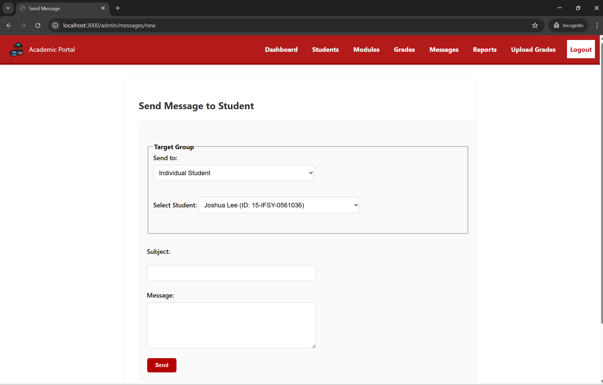

# 40176951 Academic Progression Monitoring Web App

## Student Information
- Student Number : 40176951
- Name: Niamh Kane
- Email: nkane07@qub.ac.uk
- Module: CSC7062 - Web Development

## Description
This web app was designed as part of my CSC7062 Web Development module, demonstrating my full stack web development skills using Node.js, Express, MySQL, and EJS templating. The app is designed to assist both students and staff manage academic progression, based on progression rules and CSV-based grade data. Key design principles include use of three tier architecture, MVC pattern, dynamic logic for student progression, secure login, session management, messaging and CSV import tools.

## The application includes;
- Secure login system for admin or students
- Student dashboard showing: Personal profile, Academic records (including full pass/fail/resit history), Progression decisions (automatically calculated),Messaging system for contacting staff
- Admin dashboard with: Student management (view/edit records), Grade management (upload via CSV, edit individual records), Manual progression decision overrides, Reports and module-level statistics
- Resit handling accounting for resit result when present
- Visual styling for grade outcomes (pass, fail, pass capped, excempt, absent)

## Technologies Used
- Node.js – server-side runtime
- Express – web framework and routing
- EJS – dynamic templating for views
- MySQL – relational database
- bcrypt – secure password hashing
- express-session – session control and login persistence
- multer – file uploads for profile images and CSV grades
- csv-parser – importing and parsing grades via CSV
- Chart.js – chart in admin reports

## Setup Instructions 
1. Clone repository - git clone https://gitlab.eeecs.qub.ac.uk/40176951/40176951.git
cd 40176951
2. Install dependencies - npm install
3. Import the database - Import 40176951.sql into your local MySQL server. Update const conn in app.js with your local DB credentials
4. Start the server - npm run dev
5. Open in browser - http://localhost:3000

## Test Login Credentials

### Student Login
- Use any Student ID from the database, e.g. 21-IFSY-0000001
- Password: studentpass

### Admin Login
- Use Admin ID: admin1 or admin2
- Password: adminpass123

> These test accounts and bcrypt passwords are pre-populated in the database for demonstration purposes.

## Account Recovery

If a user forgets their login credentials, they can recover them as follows:

### Forgot Username
- Click forgot username on login page
- Enter your registered email address (either from `users` or `students.contact_email` tables on the database)
- The system will return the username associated with that email

### Forgot Password
- Click forgot password on login page
- Enter your registered email address
- A temporary password will be generated and displayed in the terminal (for demonstration/testing)
- Use this password to log in, then you’ll be prompted to reset it

### Resetting Your Password
- After logging in with the temporary password from the terminal, the system will redirect you to reset password page/form
- Enter and confirm your new password to complete the reset.

## Data Source
All module, grade and enrollment data was populated from different clean versions of student_module_grade_data.csv, which included - resit attempts, grades, outcomes, module names, pathways and entry levels

## Screenshots

### 1. Login Page  
Allows both students and admins to log into the system securely using their details.  

### 2. Student Dashboard  
Provides students with quick access to their profile, grades, progression status, and messages.  

### 3. Student Profile  
Displays the student's personal and academic details with the ability to update secondary email and profile image.  

### 4. Student Grades  
Lists all modules taken by the student with grades, resits, and outcomes.  

### 5. Student Progression  
Shows automated progression decision based on academic performance.  

### 6. Student Messages  
Inbox view for students to see messages from admins and respond.  

### 7. Student - View Message Thread  
Displays full message details and allows replying to or deleting a message.  

### 8. Student - Contact Admin  
Form for students to send messages directly to an academic advisor.  

### 9. Admin Dashboard  
Main interface for admins to manage students, grades, reports, and more.  

### 10. Admin - View Students  
Searchable list of all students with pagination and level/year display.  

### 11. Admin - Manage Student  
Edit student information including name, pathway, and current year.  

### 12. Admin - Student Summary  
Detailed academic summary of an individual student with ability to override progression.  

### 13. Admin - Add New Student  
Form to register a new student manually into the system.  

### 14. Admin - Manage Grades  
View and edit individual grade records from enrolment table.  

### 15. Admin - Upload CSV  
Upload multiple student grades at once using a CSV file.  

### 16. Admin - Reports  
Average grades, top failed modules, and progression summaries.  

### 17. Admin - Manage Modules  
Edit existing module details or remove modules from the system.  

### 18. Admin - Add Module  
Form to create and register a new module.  

### 19. Admin - Edit Module  
Edit form for modifying an existing module's details.  

### 20. Admin - Messages  
Inbox view of all student-admin messages.  

### 21. Admin - View Message Thread  
Detailed thread view and admin replies to messages.  

### 22. Admin - Read vs Unread Messages  
Status highlighting of messages read/unread.  

### 23. Forgot Password  
Form to request a temporary password if forgotten.  

### 24. Forgot Username  
Form to retrieve username via registered email.  

### 25. Reset Password  
Secure form for users to reset their password after logging in with a temporary password.  

## Known Issues
- Admin notes only show most recent override note, full edit history is not maintained
- Limited client side validation, currently performed on the server-side
- All core logic is in app.js - could use modular refactoring

## Folder Structure 
- /views                      - EJS templates for each page (student/admin)
- /public                     - CSS styles, images, uploads
- /app.js                     - Main application logic and route handlers
- /utils                      - Utility functions (e.g. getAcademicYear)
- academic_progression.sql    - MySQL Database schema and sample data

## References
All references are listed in technical report

## Authors and acknowledgment
Developed by 40176951
Part of the Web Development CSC7062 module at Queens University Belfast
Special thanks to lecturer John Busch for course delivery and project support

## License
This coursework is intended for academic use and is not licensed for commercial distribution.

